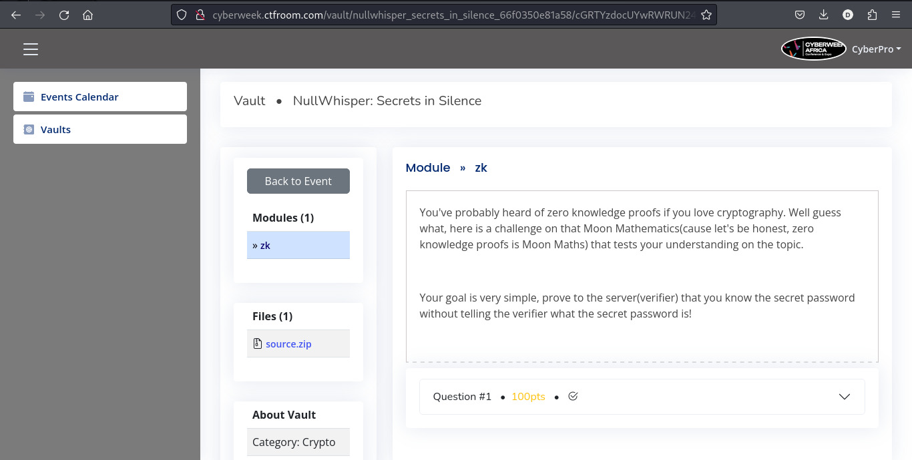

# Welcome anon! I will take you through my thought process if you care!

## The Challenge at Hand:



The objective is deceptively simple: prove to a server that i know a specific password without actually revealing the password itself. This challenge, implemented as a Rust server listening on localhost:5555, requires me to craft a client(One of the many ways i could solve this btw) that could successfully navigate the ZKP protocol and retrieve a flag as proof of completion.

"Maybe the very first mistake you made was using python" ( python slander ) - Someone not helping. I will switch to Rust once this works

## Key Components of the Challenge:

- Server: A Rust implementation listening on localhost:5555

- Client: Attempted in Python

- Protocol: Based on the Schnorr identification scheme(FROM WHAT I GOOGLED), a type of zero-knowledge proof

- Constants:
  G (Generator): 5
  P (Prime): 65521
  Password: "ProofOfKnowledge"

## The Zero-Knowledge Proof Protocol:
The challenge implemented a variant of the Schnorr identification scheme, a well-known ZKP protocol. 

# Here's a breakdown of the expected interaction:
- Client connects to the server.
- Server sends its public key.
- For each authentication attempt: 

 a. Client generates a random number r and computes y = G^r mod P.
 b. Client sends y to the server.
 c. Server responds with a random challenge.
 d. Client computes the response: (r + password_num challenge) mod P, where password_num is derived from the SHA256 hash of the password.
 e. Server verifies the response and either accepts or rejects the proof.

## Now, which of these steps have i implemented?
EVERY STEP EXCEPT THE SERVER HAS REJECTED MY PROOF! WELP!


## Installing rust

- Assuming you're on Unix system, i.e Linux or MacOS and don't have Rust installed, install Rust with the following: 

```bash
curl --proto '=https' --tlsv1.2 -sSf https://sh.rustup.rs | sh
```
- If not on a Unix system, i.e Windows(which I don't know why you're using Windows in the first place but no judgement here), follow the instructions [here](https://doc.rust-lang.org/book/ch01-01-installation.html) to install rust.

## How to run the challenge

1. Create a new rust project with `cargo new <projectName>` e.g

```bash
cargo new zk_password_verifier
```

2. Replace the default `main.rs` with our zk challenge.
3. Your `cargo.toml` file should look something like the below:

```rust
[package]
name = "zk_password_verifier"
version = "0.1.0"
edition = "2021"

[dependencies]
rand = "0.8.5"
sha2 = "0.10.6"
hex = "0.4.3"
```
I recommend having a good Rust linter to make your life easier with this challenge. If on VS Code or VS Codium, I recommend [rust-analyzer](https://marketplace.visualstudio.com/items?itemName=rust-lang.rust-analyzer) which looks like the below:


And if you're a chad on neovim, vanilla vim or God forbid emacs, check documentation [here](https://rust-analyzer.github.io/) to get rust analyzer on your development environment.


4. Run the binary as 

```bash
cargo run --release
```
5. Interact with the challenge using netcat or any other tool you see fit.

---

# May the cryptography gods be with you!
